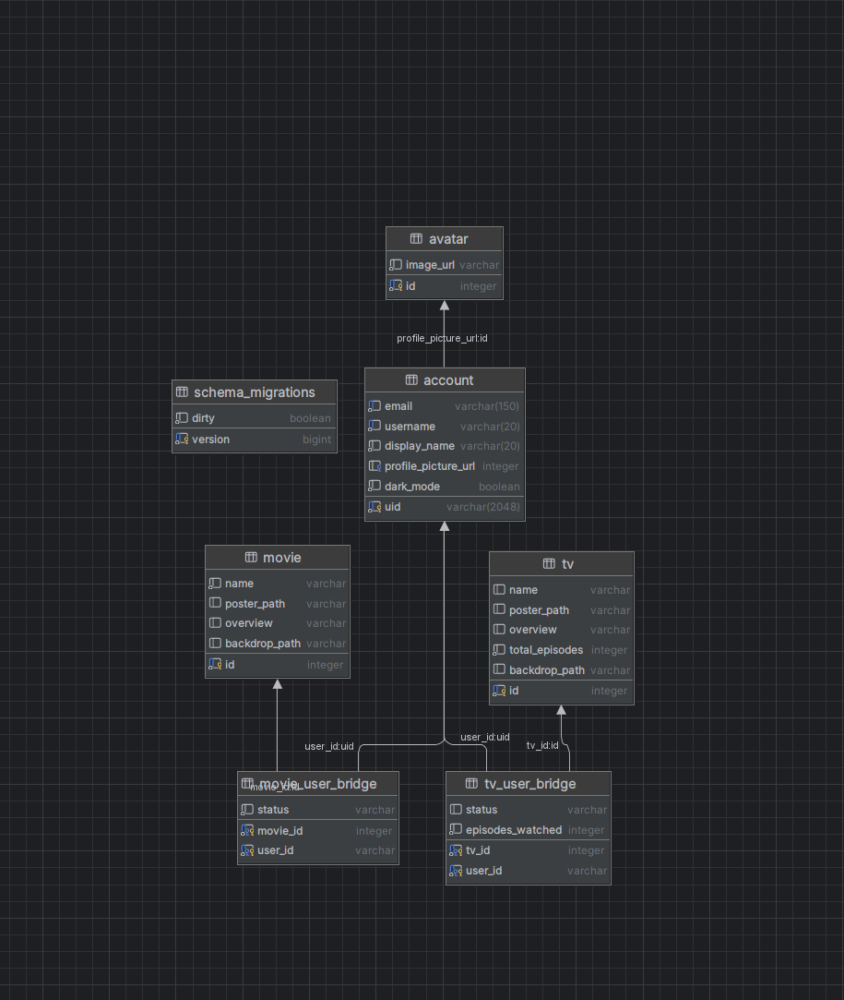

Built around using CodeBuild and CodeDeploy to ship to AWS EC2. Configured to use Systemd to restart the process when a new deployment is made.
Systemd file found under dywserver.service.

Protected by Cloudflare using end-to-end encryption. Cloudflare Cert was setup on the EC2 instance manually.

Frontend repository found at https://github.com/fueledbyespresso/did-you-watch-reactjs

Database schema
